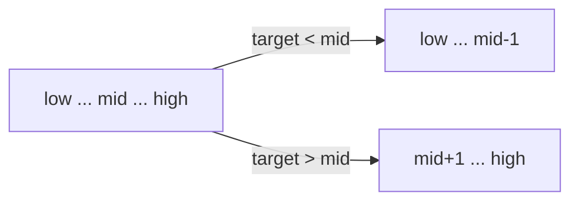

# Binary Search

## 🧠 What It Is
On a **sorted** array, repeatedly halve the search range:
1. Look at middle element
2. If equal → done
3. If smaller than target → search right half
4. If larger → search left half



## 📊 Complexity
| Case | Time | Space (iterative) | Space (recursive) |
|------|------|-------------------|-------------------|
| Best | O(1) | O(1) | O(1) |
| Average | O(log n) | O(1) | O(log n) |
| Worst | O(log n) | O(1) | O(log n) |

- **Requires sorted input.**
- Halves the search space each step → log₂(n) steps.

## 🚀 C# Implementation

### Iterative (preferred)
```csharp
public static int BinarySearch(int[] arr, int target)
{
    int low = 0, high = arr.Length - 1;
    while (low <= high)
    {
        int mid = low + (high - low) / 2;   // avoids int overflow
        if (arr[mid] == target) return mid;
        if (arr[mid] < target) low = mid + 1;
        else                   high = mid - 1;
    }
    return -1;
}
```

### Recursive
```csharp
public static int BinarySearch(int[] arr, int target, int low, int high)
{
    if (low > high) return -1;
    int mid = low + (high - low) / 2;
    if (arr[mid] == target) return mid;
    return arr[mid] < target
        ? BinarySearch(arr, target, mid + 1, high)
        : BinarySearch(arr, target, low,     mid - 1);
}
```

### Find First / Lower Bound (very common in interviews)
```csharp
// Smallest index i such that arr[i] >= target
public static int LowerBound(int[] arr, int target)
{
    int low = 0, high = arr.Length;
    while (low < high)
    {
        int mid = low + (high - low) / 2;
        if (arr[mid] < target) low = mid + 1;
        else                   high = mid;
    }
    return low;
}
```

## 🚫 Classic Pitfalls
1. **Integer overflow**: use `low + (high - low) / 2`, never `(low + high) / 2`.
2. **Off-by-one**: choose one template — `while (low <= high)` with `high = mid - 1`, OR `while (low < high)` with `high = mid`. Don't mix.
3. **Forgetting input must be sorted.**
4. **Infinite loops** when not advancing `low` / `high` (e.g., `low = mid` instead of `mid + 1`).

## 🌍 Beyond "find a number"
Binary search applies to **any monotonic predicate** `f(x)` (false…false…true…true):

- First bad version
- Minimum capacity to ship in D days
- Square root, k-th smallest, peak element
- "Search in rotated sorted array"

> **Heuristic:** if you can ask "is x feasible?" and feasibility is monotonic in x → binary search.

## 🏋️ Practice
- [Binary Search](https://leetcode.com/problems/binary-search/) (easy)
- [First Bad Version](https://leetcode.com/problems/first-bad-version/) (template)
- [Search in Rotated Sorted Array](https://leetcode.com/problems/search-in-rotated-sorted-array/) (medium)
- [Median of Two Sorted Arrays](https://leetcode.com/problems/median-of-two-sorted-arrays/) (hard)

## 📚 Key Takeaways
1. **O(log n)** — but only on sorted data
2. Always use `low + (high - low) / 2` to avoid overflow
3. Pick **one template** (lower bound / upper bound) and stick to it
4. The real superpower: applies to any monotonic decision problem
