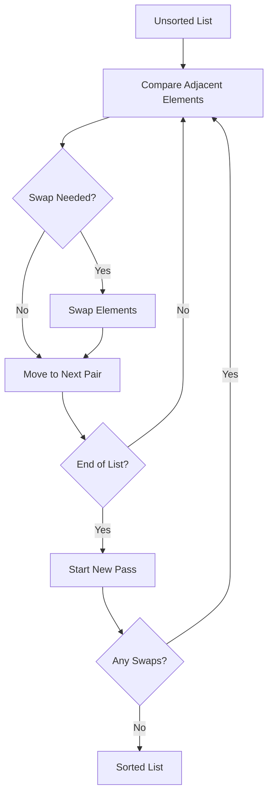

# Bubble Sort: The Simplest Sorting Algorithm

## 🧼 What is Bubble Sort?

A comparison-based sorting algorithm that repeatedly:

1. **Compares** adjacent elements
2. **Swaps** them if they're in the wrong order
3. **Bubbles** the largest element to the end each pass



## 🏆 Key Features

- **Time Complexity**:
  - Best: O(n) (already sorted)
  - Average/Worst: O(n²)
- **Space Complexity**: O(1) (in-place)
- **Stable Sort**: Maintains relative order of equal elements
- **Adaptive**: Can optimize for nearly sorted lists

---

## 🧮 Step-by-Step Example

**Input**: `[5, 1, 4, 2, 8]`

| Pass | Comparison        | Action | Current List    |
| ---- | ----------------- | ------ | --------------- |
| 1    | 5 vs 1            | Swap   | [1, 5, 4, 2, 8] |
|      | 5 vs 4            | Swap   | [1, 4, 5, 2, 8] |
|      | 5 vs 2            | Swap   | [1, 4, 2, 5, 8] |
|      | 5 vs 8            | Keep   | [1, 4, 2, 5, 8] |
| 2    | 4 vs 2            | Swap   | [1, 2, 4, 5, 8] |
|      | 4 vs 5            | Keep   | [1, 2, 4, 5, 8] |
| 3    | 1 vs 2            | Keep   | [1, 2, 4, 5, 8] |
|      | No swaps → Sorted | Done   |                 |

---

## 🚀 C# Implementation

### Basic Version

```csharp
public void BubbleSort(int[] arr)
{
    int n = arr.Length;
    for (int i = 0; i < n - 1; i++)
    {
        for (int j = 0; j < n - i - 1; j++)
        {
            if (arr[j] > arr[j + 1])
            {
                // Swap elements
                int temp = arr[j];
                arr[j] = arr[j + 1];
                arr[j + 1] = temp;
            }
        }
    }
}
```

### Optimized Version (Early Termination)

```csharp
public void OptimizedBubbleSort(int[] arr)
{
    int n = arr.Length;
    bool swapped;

    for (int i = 0; i < n - 1; i++)
    {
        swapped = false;
        for (int j = 0; j < n - i - 1; j++)
        {
            if (arr[j] > arr[j + 1])
            {
                // Swap and mark
                (arr[j], arr[j + 1]) = (arr[j + 1], arr[j]);
                swapped = true;
            }
        }

        // If no swaps, array is sorted
        if (!swapped) break;
    }
}
```

---

## 📊 Complexity Analysis

| Metric         | Complexity | Details                        |
| -------------- | ---------- | ------------------------------ |
| Time (Best)    | O(n)       | Already sorted array           |
| Time (Average) | O(n²)      | Random elements                |
| Time (Worst)   | O(n²)      | Reverse-sorted array           |
| Space          | O(1)       | In-place sorting               |
| Stable         | Yes        | Maintains equal elements order |

---

## 🆚 Comparison with Other O(n²) Algorithms

| Algorithm       | Best Case | Adaptive | Stable | Notes                     |
| --------------- | --------- | -------- | ------ | ------------------------- |
| **Bubble Sort** | O(n)      | Yes      | Yes    | Simple, good for teaching |
| Selection Sort  | O(n²)     | No       | No     | Fewer swaps               |
| Insertion Sort  | O(n)      | Yes      | Yes    | Good for small datasets   |

---

## 🚫 Common Mistakes

### 1. Off-by-One Errors

```csharp
// Wrong loop condition
for (int j = 0; j < n - i; j++) // Should be n-i-1

// Correct version
for (int j = 0; j < n - i - 1; j++)
```

### 2. Missing Optimization

```csharp
// Forgetting to check swaps
bool swapped = false; // Crucial for early termination
```

### 3. Unstable Implementation

```csharp
// Using >= instead of > breaks stability
if (arr[j] >= arr[j + 1]) // Wrong
if (arr[j] > arr[j + 1])  // Correct
```

---

## 🌍 Real-World Applications

1. **Educational Tool**: Teaching sorting concepts
2. **Small Datasets**: When n < 1000
3. **Nearly Sorted Data**: With optimized version
4. **Embedded Systems**: Minimal memory usage
5. **Debugging**: Simple to implement and verify

---

## 🏋️ Practice Problems

1. **Easy**: [Sort Colors](https://leetcode.com/problems/sort-colors/)
2. **Medium**: [Kth Largest Element](https://leetcode.com/problems/kth-largest-element-in-an-array/)
3. **Classic**: [Sorting Network Verification](https://en.wikipedia.org/wiki/Sorting_network)

---

## 📚 Key Takeaways

1. **Simplicity First**: Great for learning fundamentals
2. **Avoid for Large Data**: Use QuickSort/MergeSort instead
3. **Optimization Matters**: Early termination helps
4. **Stability Advantage**: Maintains element order
5. **Space Efficiency**: No extra memory needed

> "Bubble Sort: The algorithm that teaches us why better algorithms exist." - CS Professor
