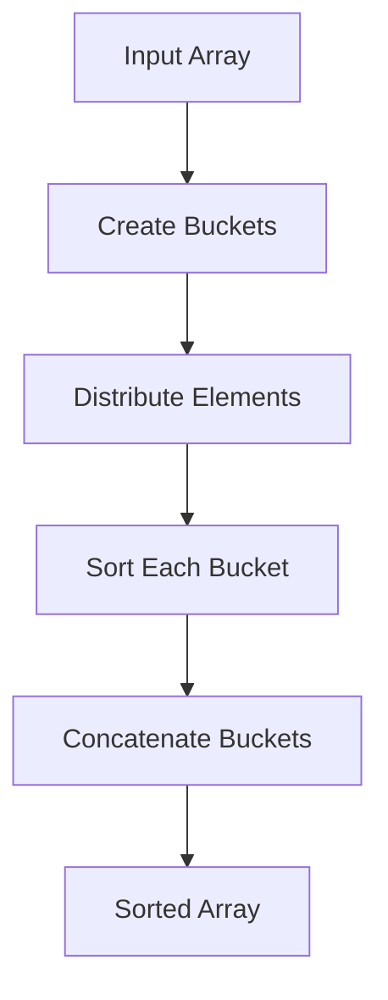

# Bucket Sort: The Distributed Sorter

## 🪣 What is Bucket Sort?

A **distribution-based** sorting algorithm that:

1. **Distributes** elements into buckets
2. **Sorts** each bucket individually
3. **Concatenates** sorted buckets
4. **Efficient** for uniformly distributed data



## 🏆 Key Features

- **Time Complexity**:
  - Best/Average: O(n + k)  
    (k = number of buckets)
  - Worst: O(n²) (poor bucket distribution)
- **Space Complexity**: O(n + k)
- **Stability**: Depends on bucket sorting algorithm
- **Not In-Place**: Requires auxiliary buckets

---

## 🧮 Step-by-Step Example

**Input**: `[0.78, 0.17, 0.39, 0.26, 0.72, 0.94, 0.21, 0.12]`  
**Buckets**: 5 (Range: 0-0.2, 0.2-0.4, 0.4-0.6, 0.6-0.8, 0.8-1.0)

### Distribution:

| Bucket | Elements           |
| ------ | ------------------ |
| 0      | [0.17, 0.12]       |
| 1      | [0.39, 0.26, 0.21] |
| 2      | []                 |
| 3      | [0.78, 0.72]       |
| 4      | [0.94]             |

### After Sorting Buckets:

| Bucket | Sorted Elements    |
| ------ | ------------------ |
| 0      | [0.12, 0.17]       |
| 1      | [0.21, 0.26, 0.39] |
| 3      | [0.72, 0.78]       |
| 4      | [0.94]             |

**Result**: `[0.12, 0.17, 0.21, 0.26, 0.39, 0.72, 0.78, 0.94]`

---

## 🚀 C# Implementations

### Basic Version (Floating-Point Numbers)

```csharp
public double[] BucketSort(double[] arr)
{
    if (arr.Length == 0) return Array.Empty<double>();

    int bucketCount = (int)Math.Sqrt(arr.Length);
    List<List<double>> buckets = new(bucketCount);

    // Initialize buckets
    for (int i = 0; i < bucketCount; i++)
        buckets.Add(new List<double>());

    // Distribute elements
    foreach (double num in arr)
    {
        int bucketIndex = (int)(num * bucketCount);
        buckets[bucketIndex].Add(num);
    }

    // Sort buckets and concatenate
    List<double> result = new();
    foreach (var bucket in buckets)
    {
        bucket.Sort();
        result.AddRange(bucket);
    }

    return result.ToArray();
}
```

### Optimized Version (Generic with Insertion Sort)

```csharp
public T[] BucketSortOptimized<T>(T[] arr, Func<T, int> bucketSelector, int bucketCount)
{
    List<T>[] buckets = new List<T>[bucketCount];
    for (int i = 0; i < bucketCount; i++)
        buckets[i] = new List<T>();

    // Distribute elements
    foreach (T item in arr)
    {
        int bucketIndex = bucketSelector(item);
        buckets[bucketIndex].Add(item);
    }

    // Sort each bucket with Insertion Sort
    List<T> result = new();
    foreach (var bucket in buckets)
    {
        InsertionSort(bucket);
        result.AddRange(bucket);
    }

    return result.ToArray();
}

private void InsertionSort<T>(List<T> list) where T : IComparable<T>
{
    for (int i = 1; i < list.Count; i++)
    {
        T current = list[i];
        int j = i - 1;

        while (j >= 0 && list[j].CompareTo(current) > 0)
        {
            list[j + 1] = list[j];
            j--;
        }
        list[j + 1] = current;
    }
}
```

---

## 📊 Complexity Analysis

| Scenario     | Time Complexity | Space Complexity |
| ------------ | --------------- | ---------------- |
| Best Case    | O(n + k)        | O(n + k)         |
| Average Case | O(n + k)        | O(n + k)         |
| Worst Case   | O(n²)           | O(n + k)         |
| Parallelized | O(n/p + k)      | O(n + k)         |

---

## 🆚 Comparison with Other Algorithms

| Algorithm       | Time        | Stable | Data Types           | Best Case          |
| --------------- | ----------- | ------ | -------------------- | ------------------ |
| **Bucket Sort** | O(n + k)    | Yes\*  | Uniform Distribution | Known distribution |
| Quick Sort      | O(n log n)  | No     | General              | General-purpose    |
| Radix Sort      | O(d(n + b)) | Yes    | Integer/Strings      | Fixed-width keys   |

---

## 🚫 Common Mistakes

1. **Poor Bucket Count**:

   ```csharp
   int bucketCount = arr.Length; // Too many buckets → O(n²) space
   // Optimal: sqrt(n) or based on data distribution
   ```

2. **Incorrect Bucket Mapping**:

   ```csharp
   int bucketIndex = (int)num; // Doesn't handle decimal ranges
   // Correct for 0-1: (int)(num * bucketCount)
   ```

3. **Unstable Bucket Sorting**:
   ```csharp
   Array.Sort(bucket); // Default sort might be unstable
   // Use stable sort like Insertion Sort
   ```

---

## 🌍 Real-World Applications

1. **Database Systems**: Range partitioning
2. **Graphics Processing**: Depth sorting
3. **Scientific Computing**: Distributed datasets
4. **E-commerce**: Price range filtering
5. **Network Systems**: Packet size distribution

---

## 🏋️ Practice Problems

1. **Medium**: [Top K Frequent Elements](https://leetcode.com/problems/top-k-frequent-elements/)
2. **Hard**: [Maximum Gap](https://leetcode.com/problems/maximum-gap/)
3. **Expert**: [Sort Colors](https://leetcode.com/problems/sort-colors/)

---

## 📚 Key Takeaways

1. **Distribution Matters**: Optimal for uniform data
2. **Hybrid Approach**: Combine with Insertion Sort
3. **Bucket Count**: Crucial for performance (√n is common)
4. **Generic Handling**: Can sort any mappable data
5. **Parallel Potential**: Independent bucket processing

> "Bucket Sort: Divide, distribute, and conquer with spatial awareness." - Algorithm Enthusiast
