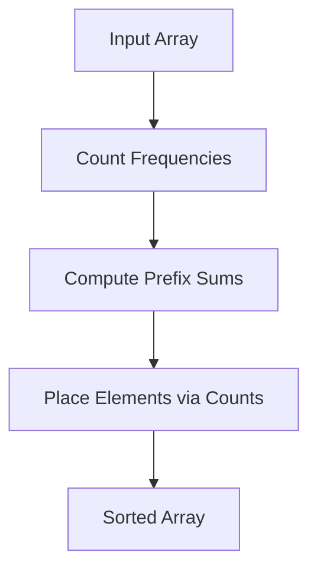

# Counting Sort: The Integer Sorting Specialist

## 🔢 What is Counting Sort?

A **non-comparison**, **integer-sorting** algorithm that:

1. **Counts** occurrences of each unique element
2. **Computes** prefix sums to determine positions
3. **Places** elements directly into sorted positions
4. **Stable**: Preserves order of equal elements

**Best Used When**:

- Input range (max - min) is small (𝑘 ≈ 𝑛)
- Elements are integers (or mappable to integers)



## 🏆 Key Features

- **Time Complexity**: O(n + k)  
  (k = max - min + 1)
- **Space Complexity**: O(n + k)
- **Stable Sort**: Equal elements retain original order
- **Not In-Place**: Requires auxiliary arrays

---

## 🧮 Step-by-Step Example

**Input**: `[4, 2, 2, 8, 3, 3, 1]`

### Phase 1: Frequency Counting

| Value | 1   | 2   | 3   | 4   | 8   |
| ----- | --- | --- | --- | --- | --- |
| Count | 1   | 2   | 2   | 1   | 1   |

### Phase 2: Prefix Sums (Positions)

| Value | 1   | 2   | 3   | 4   | 8   |
| ----- | --- | --- | --- | --- | --- |
| Index | 0   | 1   | 3   | 5   | 6   |

### Phase 3: Element Placement

| Step | Input | Count Array | Output          |
| ---- | ----- | ----------- | --------------- |
| 1    | 1     | [0,1,3,5,6] | [1]             |
| 2    | 3     | [0,1,3,5,6] | [1,2,2,3]       |
| 3    | 3     | [0,1,3,5,6] | [1,2,2,3,3]     |
| 4    | 4     | [0,1,3,5,6] | [1,2,2,3,3,4]   |
| 5    | 8     | [0,1,3,5,6] | [1,2,2,3,3,4,8] |

---

## 🚀 C# Implementation

### Basic Version

```csharp
public int[] CountingSort(int[] arr)
{
    if (arr.Length == 0) return Array.Empty<int>();

    int min = arr.Min();
    int max = arr.Max();
    int range = max - min + 1;

    int[] count = new int[range];
    int[] output = new int[arr.Length];

    // Count frequencies
    foreach (int num in arr)
        count[num - min]++;

    // Compute prefix sums (positions)
    for (int i = 1; i < range; i++)
        count[i] += count[i - 1];

    // Place elements in sorted order
    for (int i = arr.Length - 1; i >= 0; i--)
    {
        int pos = count[arr[i] - min] - 1;
        output[pos] = arr[i];
        count[arr[i] - min]--;
    }

    return output;
}
```

### Optimized Version (Reduced Memory)

```csharp
public int[] CountingSortOptimized(int[] arr)
{
    if (arr.Length == 0) return Array.Empty<int>();

    int min = arr.Min();
    int max = arr.Max();
    int range = max - min + 1;

    int[] count = new int[range];

    // Count frequencies
    foreach (int num in arr)
        count[num - min]++;

    // Overwrite input array directly
    int index = 0;
    for (int i = 0; i < range; i++)
    {
        while (count[i] > 0)
        {
            arr[index++] = i + min;
            count[i]--;
        }
    }

    return arr;
}
```

---

## 📊 Complexity Analysis

| Metric      | Complexity | Details                         |
| ----------- | ---------- | ------------------------------- |
| Time        | O(n + k)   | Dominated by range size (k)     |
| Space       | O(n + k)   | Count array + output array      |
| Stability   | Yes        | Maintains equal elements' order |
| Comparisons | 0          | No element comparisons          |

---

## 🆚 Comparison with Other Algorithms

| Algorithm    | Time        | Stable | Integer-Only | Best Case        |
| ------------ | ----------- | ------ | ------------ | ---------------- |
| **Counting** | O(n + k)    | Yes    | Yes          | Small k (k ≈ n)  |
| Quick Sort   | O(n log n)  | No     | No           | General-purpose  |
| Radix Sort   | O(d(n + b)) | Yes    | Yes          | Fixed-width ints |

---

## 🚫 Common Mistakes

1. **Negative Numbers**:

   ```csharp
   // Fails if min is negative
   int pos = count[arr[i]] - 1; // Wrong
   int pos = count[arr[i] - min] - 1; // Correct
   ```

2. **Index Overflow**:

   ```csharp
   // Incorrect range calculation
   int range = max + 1; // Fails if min > 0
   int range = max - min + 1; // Correct
   ```

3. **Stability Loss**:
   ```csharp
   // Forward iteration breaks stability
   for (int i = 0; i < arr.Length; i++) // Wrong
   for (int i = arr.Length - 1; i >= 0; i--) // Correct
   ```

---

## 🌍 Real-World Applications

1. **Histogram Generation**: Frequency analysis
2. **Grade Systems**: Sorting test scores (0-100)
3. **Age Demographics**: Population age sorting
4. **Voting Systems**: Tallying integer votes
5. **DNA Analysis**: Nucleotide frequency counting

---

## 🏋️ Practice Problems

1. **Easy**: [Sort Colors](https://leetcode.com/problems/sort-colors/)
2. **Medium**: [H-Index](https://leetcode.com/problems/h-index/)
3. **Hard**: [Maximum Gap](https://leetcode.com/problems/maximum-gap/)

---

## 📚 Key Takeaways

1. **Range Dependency**: Ideal when k ≈ O(n)
2. **Stability Matters**: Critical for compound sorts
3. **No Comparisons**: Pure counting mechanism
4. **Integer Limitation**: Works only with discrete values
5. **Foundation**: Basis for Radix Sort

> "Counting Sort: When you know your elements' bounds, break the O(n log n) barrier!" - Algorithm Enthusiast
