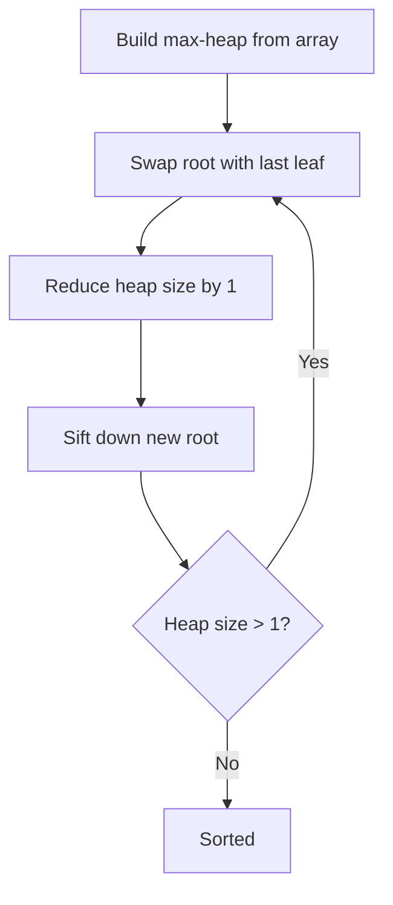

# Heap Sort

## 🧠 What It Is
Sort by repeatedly extracting the max from a **max-heap**:

1. **Build a max-heap** from the array (in place, O(n))
2. **Swap** the root (max) with the last element, shrink heap by 1
3. **Sift down** the new root to restore the heap property
4. Repeat until heap size = 1



## 📊 Complexity
| Case | Time | Space |
|------|------|-------|
| Best | O(n log n) | O(1) |
| Average | O(n log n) | O(1) |
| Worst | O(n log n) | O(1) |

- **In-place** ✅
- **Stable**: ❌ (equal elements may reorder)
- **Predictable**: same complexity in all cases — no worst-case surprises like Quick Sort

## 🚀 C# Implementation

```csharp
public static void HeapSort(int[] arr)
{
    int n = arr.Length;

    // 1. Build max-heap (start from last non-leaf, sift down)
    for (int i = n / 2 - 1; i >= 0; i--)
        SiftDown(arr, i, n);

    // 2. Extract max one by one
    for (int end = n - 1; end > 0; end--)
    {
        (arr[0], arr[end]) = (arr[end], arr[0]);  // move max to end
        SiftDown(arr, 0, end);                    // restore heap on [0..end)
    }
}

// Sift node at index `i` down within heap of logical size `heapSize`
private static void SiftDown(int[] arr, int i, int heapSize)
{
    while (true)
    {
        int left  = 2 * i + 1;
        int right = 2 * i + 2;
        int largest = i;

        if (left  < heapSize && arr[left]  > arr[largest]) largest = left;
        if (right < heapSize && arr[right] > arr[largest]) largest = right;

        if (largest == i) return;
        (arr[i], arr[largest]) = (arr[largest], arr[i]);
        i = largest;
    }
}
```

## 🧠 Why "Build heap" is O(n), not O(n log n)
You'd think calling `SiftDown` on n nodes is O(n log n), but most nodes are near the leaves and sift very little. Summing the work per level gives `Σ (n / 2^(h+1)) · h ≈ n` — a classic interview gotcha.

## 🆚 Heap Sort vs Merge Sort vs Quick Sort
| | Heap Sort | Merge Sort | Quick Sort |
|---|---|---|---|
| Worst case | O(n log n) | O(n log n) | O(n²) |
| Space | O(1) | O(n) | O(log n) avg |
| Stable | ❌ | ✅ | ❌ |
| Cache-friendly | ❌ (scatters access) | Moderate | ✅ Excellent |
| In-place | ✅ | ❌ | ✅ |
| Real-world speed | Slowest of the three | Fast | **Usually fastest** |

**Where Heap Sort wins:** when you need O(n log n) **worst-case guarantee** with O(1) extra memory (e.g., embedded systems, real-time guarantees).

## 🌍 Real-World Uses
- **Priority queues** (the heap structure itself, not the sort)
- **Top-K problems** (use a min-heap of size K → O(n log K))
- Selection algorithms (finding k-th largest)
- Schedulers, Dijkstra's algorithm

## 🚫 Common Mistakes
1. Building the heap top-down (`for i = 0..n/2`) instead of bottom-up — gives O(n log n) build instead of O(n)
2. Using `2*i, 2*i+1` (1-indexed) instead of `2*i+1, 2*i+2` (0-indexed)
3. Forgetting to shrink the heap size after extracting the max → infinite loop or wrong sort

## 🏋️ Practice
- [Kth Largest Element in an Array](https://leetcode.com/problems/kth-largest-element-in-an-array/)
- [Top K Frequent Elements](https://leetcode.com/problems/top-k-frequent-elements/)
- [Merge K Sorted Lists](https://leetcode.com/problems/merge-k-sorted-lists/)

## 📚 Key Takeaways
1. **O(n log n)** in **all** cases — no worst-case blowup
2. **In-place** with **O(1)** extra space
3. **Not stable**, **not cache-friendly** → why Quick Sort usually wins in practice
4. The heap data structure itself is more useful than the sort
