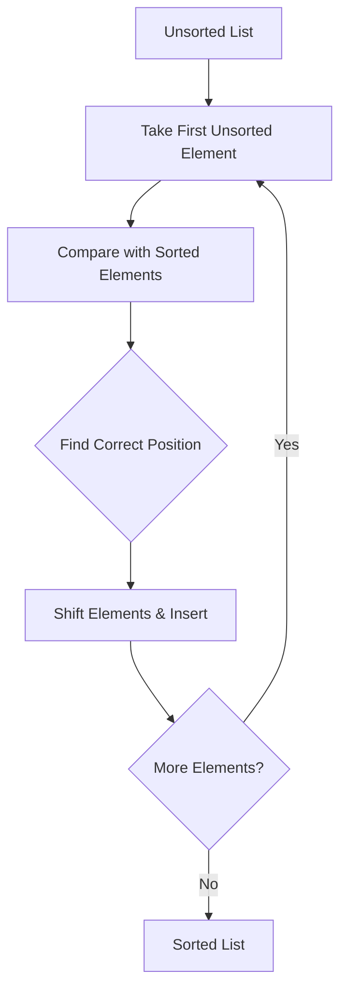

# Insertion Sort: The Adaptive Sorter

## 📌 What is Insertion Sort?

A simple, efficient sorting algorithm for **small datasets** that:

1. **Builds** a sorted array one element at a time
2. **Compares** elements to find correct position
3. **Shifts** elements to insert new item
4. **Adapts** to partially sorted data efficiently



## 🏆 Key Features

- **Time Complexity**:
  - Best: O(n) (already sorted)
  - Average/Worst: O(n²)
- **Space Complexity**: O(1) (in-place)
- **Stable Sort**: Maintains equal elements' order
- **Adaptive**: Faster on partially sorted data

---

## 🧮 Step-by-Step Example

**Input**: `[5, 2, 4, 6, 1, 3]`

| Pass | Sorted Region | Current Element | Action                        |
| ---- | ------------- | --------------- | ----------------------------- |
| 1    | [5]           | 2               | Insert before 5 → [2,5]       |
| 2    | [2,5]         | 4               | Insert after 2 → [2,4,5]      |
| 3    | [2,4,5]       | 6               | Keep position → [2,4,5,6]     |
| 4    | [2,4,5,6]     | 1               | Insert first → [1,2,4,5,6]    |
| 5    | [1,2,4,5,6]   | 3               | Insert after 2 → Final sorted |

**Result**: `[1, 2, 3, 4, 5, 6]`

---

## 🚀 C# Implementations

### Standard Version

```csharp
public void InsertionSort(int[] arr)
{
    for (int i = 1; i < arr.Length; i++)
    {
        int current = arr[i];
        int j = i - 1;

        while (j >= 0 && arr[j] > current)
        {
            arr[j + 1] = arr[j]; // Shift elements
            j--;
        }
        arr[j + 1] = current; // Insert
    }
}
```

### Optimized Version (Early Termination)

```csharp
public void OptimizedInsertionSort(int[] arr)
{
    for (int i = 1; i < arr.Length; i++)
    {
        int current = arr[i];
        int j = i - 1;

        // Exit early if already in place
        if (arr[j] <= current) continue;

        do {
            arr[j + 1] = arr[j];
            j--;
        } while (j >= 0 && arr[j] > current);

        arr[j + 1] = current;
    }
}
```

---

## 📊 Complexity Analysis

| Metric         | Complexity | Details                          |
| -------------- | ---------- | -------------------------------- |
| Time (Best)    | O(n)       | Already sorted array             |
| Time (Average) | O(n²)      | Random elements                  |
| Time (Worst)   | O(n²)      | Reverse-sorted array             |
| Space          | O(1)       | In-place sorting                 |
| Comparisons    | O(n²)      | Up to i comparisons for ith item |

---

## 🆚 Comparison with Other O(n²) Algorithms

| Algorithm     | Best Case | Adaptive | Stable | Swaps | Ideal Use Case         |
| ------------- | --------- | -------- | ------ | ----- | ---------------------- |
| **Insertion** | O(n)      | Yes      | Yes    | O(n²) | Small/partially sorted |
| Bubble        | O(n)      | Yes      | Yes    | O(n²) | Educational purposes   |
| Selection     | O(n²)     | No       | No     | O(n)  | Minimal swap scenarios |

---

## 🚫 Common Mistakes

### 1. Incorrect Loop Initialization

```csharp
// Wrong starting index
for (int i = 0; i < arr.Length; i++) // Should start at 1

// Correct
for (int i = 1; i < arr.Length; i++)
```

### 2. Off-by-One Errors

```csharp
// Wrong insertion index
arr[j] = current; // Should be j+1
```

### 3. Missing Shift Operations

```csharp
// Forgetting to shift elements
arr[j + 1] = current; // Without shifting
```

---

## 🌍 Real-World Applications

1. **Online Sorting**: Adding elements incrementally
2. **Small Datasets**: n < 1000 elements
3. **Hybrid Algorithms**: Used in TimSort and IntroSort
4. **Card Games**: Mimics manual card sorting
5. **Database Optimization**: Maintain sorted inserts

---

## 🏋️ Practice Problems

1. **Easy**: [Insertion Sort List](https://leetcode.com/problems/insertion-sort-list/)
2. **Medium**: [Sort an Array](https://leetcode.com/problems/sort-an-array/)
3. **Classic**: [Insertion Sort Visualization](https://www.hackerearth.com/practice/algorithms/sorting/insertion-sort/visualize/)

---

## 📚 Key Takeaways

1. **Adaptive Nature**: Excels with partially sorted data
2. **Stability**: Preserves original order of equals
3. **Low Overhead**: Simple implementation, no recursion
4. **Practical Limit**: Ideal for n ≤ 1000
5. **Foundation**: Basis for advanced algorithms

> "Insertion Sort: The unsung hero of small dataset sorting." - Software Engineer
