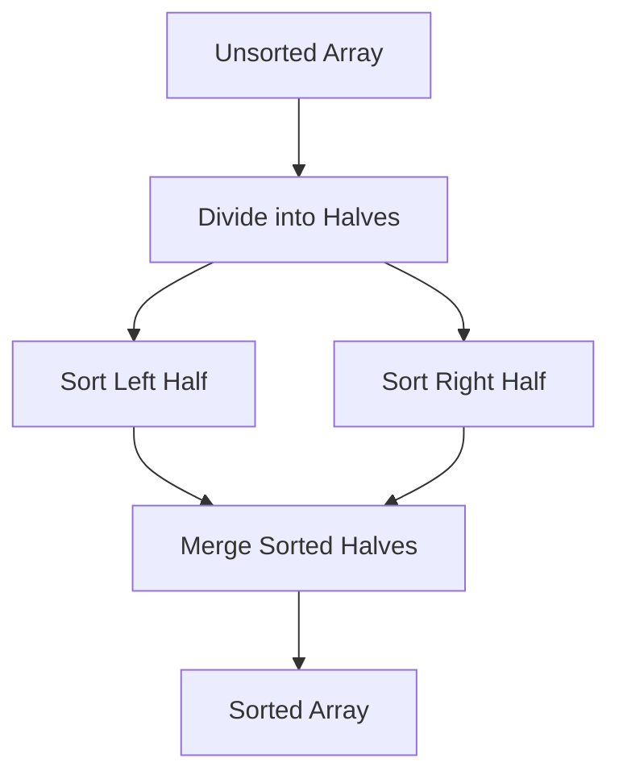
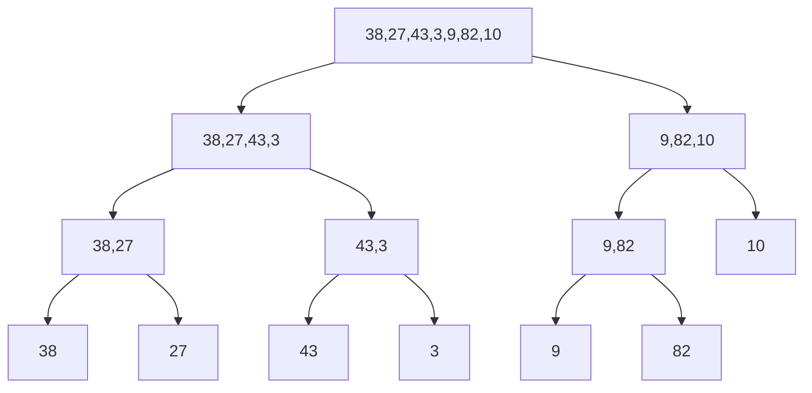
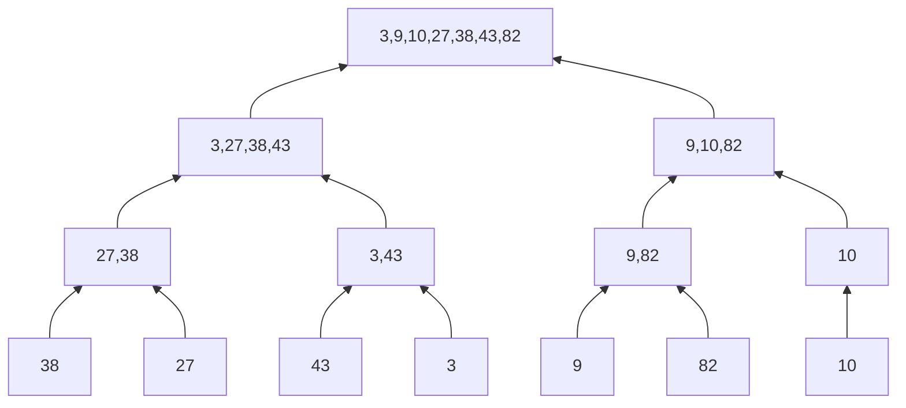

# Merge Sort: The Divide & Conquer Master

## 🔄 What is Merge Sort?

A **stable**, **comparison-based** sorting algorithm using the **divide-and-conquer** paradigm:

1. **Divide**: Split the array into two halves
2. **Conquer**: Recursively sort each half
3. **Combine**: Merge the sorted halves into one sorted array



## 🏆 Key Features

- **Time Complexity**: O(n log n) in all cases
- **Space Complexity**: O(n) auxiliary space
- **Stable Sort**: Preserves order of equal elements
- **Parallelizable**: Ideal for multi-threaded environments

---

## 🧮 Step-by-Step Example

**Input**: `[38, 27, 43, 3, 9, 82, 10]`

### Division Phase:



### Merging Phase:



---

## 🚀 C# Implementation

### Recursive Implementation

```csharp
public void MergeSort(int[] arr)
{
    if (arr.Length <= 1) return;

    int mid = arr.Length / 2;
    int[] left = arr[..mid];
    int[] right = arr[mid..];

    MergeSort(left);
    MergeSort(right);
    Merge(arr, left, right);
}

private void Merge(int[] result, int[] left, int[] right)
{
    int i = 0, l = 0, r = 0;

    while (l < left.Length && r < right.Length)
    {
        result[i++] = (left[l] <= right[r])
            ? left[l++]
            : right[r++];
    }

    while (l < left.Length) result[i++] = left[l++];
    while (r < right.Length) result[i++] = right[r++];
}
```

### Optimized In-Place Version

```csharp
public void MergeSortOptimized(int[] arr)
{
    int[] temp = new int[arr.Length];
    MergeSortHelper(arr, 0, arr.Length - 1, temp);
}

private void MergeSortHelper(int[] arr, int left, int right, int[] temp)
{
    if (left >= right) return;

    int mid = left + (right - left) / 2;
    MergeSortHelper(arr, left, mid, temp);
    MergeSortHelper(arr, mid + 1, right, temp);
    MergeInPlace(arr, left, mid, right, temp);
}

private void MergeInPlace(int[] arr, int left, int mid, int right, int[] temp)
{
    int i = left, j = mid + 1, k = left;

    while (i <= mid && j <= right)
        temp[k++] = (arr[i] <= arr[j]) ? arr[i++] : arr[j++];

    while (i <= mid) temp[k++] = arr[i++];
    while (j <= right) temp[k++] = arr[j++];

    Array.Copy(temp, left, arr, left, right - left + 1);
}
```

---

## 📊 Complexity Analysis

| Metric           | Complexity | Details                             |
| ---------------- | ---------- | ----------------------------------- |
| Time (All Cases) | O(n log n) | Logarithmic division + linear merge |
| Space            | O(n)       | Auxiliary array for merging         |
| Comparisons      | O(n log n) | Optimal for comparison sorts        |
| Stability        | Yes        | Equal elements retain order         |

---

## 🆚 Comparison with O(n log n) Algorithms

| Algorithm      | Space    | Stable | In-Place | Best For           |
| -------------- | -------- | ------ | -------- | ------------------ |
| **Merge Sort** | O(n)     | Yes    | No       | External sorting   |
| Quick Sort     | O(log n) | No     | Yes      | General-purpose    |
| Heap Sort      | O(1)     | No     | Yes      | Memory-constrained |

---

## 🚫 Common Mistakes

### 1. Index Calculation Errors

```csharp
// Wrong mid calculation causing overflow
int mid = (left + right) / 2; // Potential overflow
// Correct:
int mid = left + (right - left) / 2;
```

### 2. Memory Inefficiency

```csharp
// Creating new arrays recursively → O(n log n) space
// Solution: Use single shared temp array
```

### 3. Stability Violation

```csharp
// Using < instead of <= breaks stability
arr[i] < arr[j] // Wrong
arr[i] <= arr[j] // Correct
```

---

## 🌍 Real-World Applications

1. **External Sorting**: Large datasets (Big Data)
2. **Database Systems**: Sorting query results
3. **Inversion Counting**: Financial analysis
4. **Linked List Sorting**: Optimal for O(1) merge
5. **Version Control**: Merge conflict resolution

---

## 🏋️ Practice Problems

1. **Medium**: [Sort an Array](https://leetcode.com/problems/sort-an-array/)
2. **Hard**: [Count of Smaller Numbers After Self](https://leetcode.com/problems/count-of-smaller-numbers-after-self/)
3. **Expert**: [Reverse Pairs](https://leetcode.com/problems/reverse-pairs/)

---

## 📚 Key Takeaways

1. **Predictable Performance**: Always O(n log n)
2. **Stability Advantage**: Critical for multi-key sorting
3. **External Sorting**: Handles data larger than memory
4. **Memory Tradeoff**: Requires O(n) auxiliary space
5. **Parallel Potential**: Easy multi-threaded implementation

> "Merge Sort: The algorithm that proves divide-and-conquer can conquer all." - CS Wisdom
