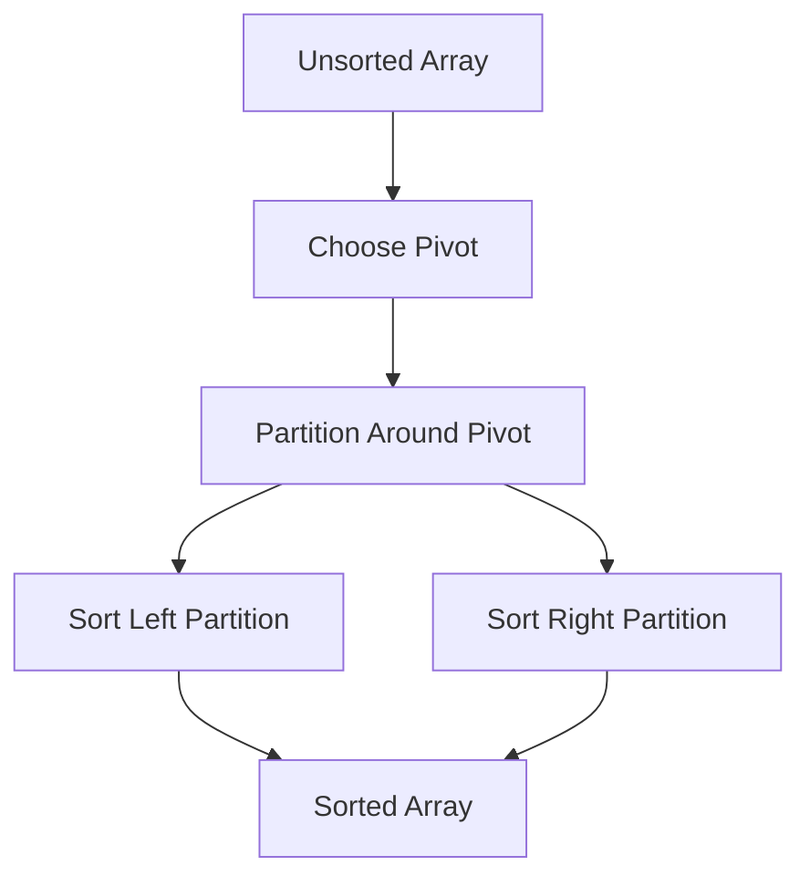
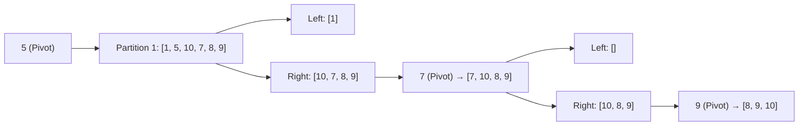

# Quick Sort: The Speed Demon of Sorting

## 🚀 What is Quick Sort?

A **divide-and-conquer** algorithm that:

1. **Chooses** a pivot element
2. **Partitions** the array into elements ≤ pivot and ≥ pivot
3. **Recursively sorts** the partitions
4. **Combines** results (pivot in final position)



## 🏆 Key Features

- **Time Complexity**:
  - Best/Average: O(n log n)
  - Worst: O(n²) (rare with good pivot selection)
- **Space Complexity**: O(log n) stack space (average)
- **In-Place**: Minimal memory overhead
- **Unstable**: May change order of equal elements

---

## 🎯 Pivot Selection Strategies

| Method              | Pros                | Cons                      |
| ------------------- | ------------------- | ------------------------- |
| **First Element**   | Simple to implement | Worst-case on sorted data |
| **Last Element**    | Easy implementation | Same as first             |
| **Random**          | Avoids worst-case   | Slightly more complex     |
| **Median-of-Three** | Balanced partitions | Extra comparisons         |

---

## 🧮 Step-by-Step Example

**Input**: `[10, 7, 8, 9, 1, 5]`

### Partitioning Process (Lomuto scheme, last element pivot):



**Final Sorted Array**: `[1, 5, 7, 8, 9, 10]`

---

## 🚀 C# Implementations

### Lomuto Partition Scheme

```csharp
public void QuickSort(int[] arr, int low, int high)
{
    if (low < high)
    {
        int pi = PartitionLomuto(arr, low, high);
        QuickSort(arr, low, pi - 1);
        QuickSort(arr, pi + 1, high);
    }
}

private int PartitionLomuto(int[] arr, int low, int high)
{
    int pivot = arr[high];
    int i = low - 1;

    for (int j = low; j < high; j++)
    {
        if (arr[j] <= pivot)
        {
            i++;
            (arr[i], arr[j]) = (arr[j], arr[i]);
        }
    }
    (arr[i+1], arr[high]) = (arr[high], arr[i+1]);
    return i + 1;
}
```

### Hoare's Partition Scheme (More Efficient)

```csharp
public void QuickSortHoare(int[] arr, int low, int high)
{
    if (low < high)
    {
        int pi = PartitionHoare(arr, low, high);
        QuickSortHoare(arr, low, pi);
        QuickSortHoare(arr, pi + 1, high);
    }
}

private int PartitionHoare(int[] arr, int low, int high)
{
    int pivot = arr[low + (high - low) / 2]; // Median pivot
    int i = low - 1;
    int j = high + 1;

    while (true)
    {
        do i++; while (arr[i] < pivot);
        do j--; while (arr[j] > pivot);

        if (i >= j) return j;
        (arr[i], arr[j]) = (arr[j], arr[i]);
    }
}
```

---

## 📊 Complexity Analysis

| Scenario     | Time Complexity | Space Complexity |
| ------------ | --------------- | ---------------- |
| Best Case    | O(n log n)      | O(log n)         |
| Average Case | O(n log n)      | O(log n)         |
| Worst Case   | O(n²)           | O(n)             |
| Parallelized | O(n)            | O(n)             |

---

## 🆚 Comparison with Other Algorithms

| Algorithm      | Best Case  | Worst Case | Stable | In-Place | Cache Friendly |
| -------------- | ---------- | ---------- | ------ | -------- | -------------- |
| **Quick Sort** | O(n log n) | O(n²)      | No     | Yes      | Excellent      |
| Merge Sort     | O(n log n) | O(n log n) | Yes    | No       | Moderate       |
| Heap Sort      | O(n log n) | O(n log n) | No     | Yes      | Poor           |

---

## 🚫 Common Mistakes

1. **Bad Pivot Selection**:

   ```csharp
   int pivot = arr[high]; // Can lead to O(n²) on sorted arrays
   // Better: Median-of-three
   ```

2. **Stack Overflow**:

   ```csharp
   // Mitigate with tail recursion optimization
   QuickSort(arr, pi + 1, high); // Process larger partition first
   ```

3. **Partition Imbalance**:
   ```csharp
   // Use insertion sort for small partitions (n ≤ 16)
   if (high - low < 16) InsertionSort(arr, low, high);
   ```

---

## 🌍 Real-World Applications

1. **Programming Languages**: C# `Array.Sort()` hybrid
2. **Database Systems**: Query optimization
3. **Numerical Computations**: Matrix operations
4. **Machine Learning**: Feature sorting
5. **Competitive Programming**: Fast average-case

---

## 🏋️ Practice Problems

1. **Medium**: [Sort an Array](https://leetcode.com/problems/sort-an-array/)
2. **Hard**: [Kth Largest Element](https://leetcode.com/problems/kth-largest-element-in-an-array/)
3. **Expert**: [Wiggle Sort II](https://leetcode.com/problems/wiggle-sort-ii/)

---

## 📚 Key Takeaways

1. **Pivot Choice Matters**: Use median-of-three
2. **Hybrid Approach**: Combine with Insertion Sort
3. **Cache Efficiency**: Excellent memory locality
4. **Parallel Potential**: Divide-and-conquer nature
5. **Unstable but Fast**: Preferred for primitive types

> "Quick Sort: The algorithm that's usually quick, but sometimes quirky." - Algorithm Enthusiast
