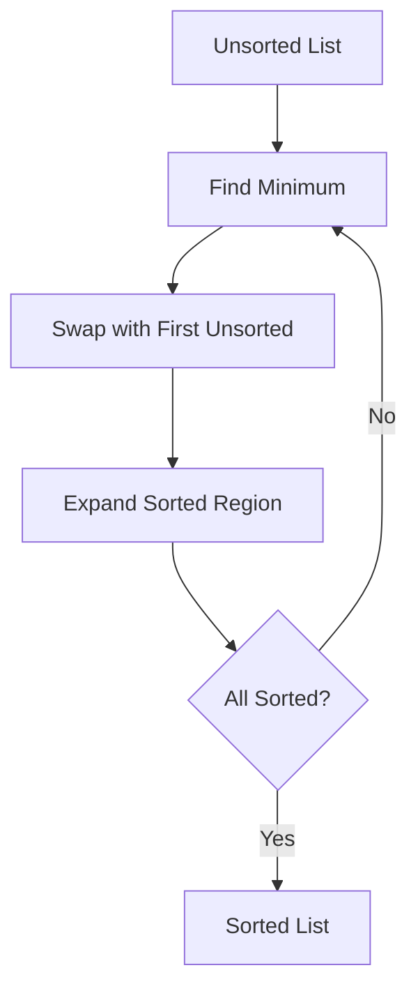

# Selection Sort: The Minimum Hunter

## 🎯 What is Selection Sort?

A comparison-based sorting algorithm that:

1. **Divides** the list into sorted (left) and unsorted (right) regions
2. **Finds** the minimum element in the unsorted region
3. **Swaps** it with the leftmost unsorted element
4. **Expands** the sorted region until completion



## 🏆 Key Features

- **Time Complexity**:
  - Best/Average/Worst: O(n²)
- **Space Complexity**: O(1) (in-place)
- **Unstable Sort**: May change order of equal elements
- **Minimal Swaps**: O(n) total swaps (better than Bubble Sort)

---

## 🧮 Step-by-Step Example

**Input**: `[29, 10, 14, 37, 13]`

| Pass | Sorted Region | Unsorted Region  | Minimum | Action           |
| ---- | ------------- | ---------------- | ------- | ---------------- |
| 1    | []            | [29,10,14,37,13] | 10      | Swap 29 ↔ 10     |
| 2    | [10]          | [29,14,37,13]    | 13      | Swap 29 ↔ 13     |
| 3    | [10,13]       | [14,37,29]       | 14      | Already in place |
| 4    | [10,13,14]    | [37,29]          | 29      | Swap 37 ↔ 29     |
| 5    | [10,13,14,29] | [37]             | 37      | Done             |

**Final Sorted List**: `[10, 13, 14, 29, 37]`

---

## 🚀 C# Implementation

### Standard Version

```csharp
public void SelectionSort(int[] arr)
{
    int n = arr.Length;

    for (int i = 0; i < n - 1; i++)
    {
        int minIndex = i;

        // Find minimum in unsorted region
        for (int j = i + 1; j < n; j++)
        {
            if (arr[j] < arr[minIndex])
                minIndex = j;
        }

        // Swap if needed
        if (minIndex != i)
        {
            int temp = arr[i];
            arr[i] = arr[minIndex];
            arr[minIndex] = temp;
        }
    }
}
```

### Optimized Version (Reduced Comparisons)

```csharp
public void OptimizedSelectionSort(int[] arr)
{
    int n = arr.Length;

    for (int i = 0; i < n - 1; i++)
    {
        int minIndex = i;
        bool needsSwap = false;

        // Find minimum and check if swap needed
        for (int j = i + 1; j < n; j++)
        {
            if (arr[j] < arr[minIndex])
            {
                minIndex = j;
                needsSwap = true;
            }
        }

        // Perform swap only if necessary
        if (needsSwap)
        {
            (arr[i], arr[minIndex]) = (arr[minIndex], arr[i]);
        }
    }
}
```

---

## 📊 Complexity Analysis

| Metric           | Complexity | Details                   |
| ---------------- | ---------- | ------------------------- |
| Time (All Cases) | O(n²)      | Nested loops              |
| Space            | O(1)       | In-place sorting          |
| Comparisons      | O(n²)      | Fixed regardless of input |
| Swaps            | O(n)       | Maximum n-1 swaps         |

---

## 🆚 Comparison with Other O(n²) Algorithms

| Algorithm     | Best Case | Swaps | Stable | Adaptive | Use Case               |
| ------------- | --------- | ----- | ------ | -------- | ---------------------- |
| **Selection** | O(n²)     | O(n)  | No     | No       | Minimal swap scenarios |
| Bubble        | O(n)      | O(n²) | Yes    | Yes      | Educational purposes   |
| Insertion     | O(n)      | O(n²) | Yes    | Yes      | Small/partially sorted |

---

## 🚫 Common Mistakes

### 1. Incorrect Index Handling

```csharp
// Wrong initial minIndex
int minIndex = 0; // Should be i
// Correct:
int minIndex = i;
```

### 2. Unnecessary Swaps

```csharp
// Missing swap check
if (minIndex != i) // Crucial for efficiency
```

### 3. Off-by-One Errors

```csharp
// Wrong loop condition
for (int j = i; j < n; j++) // Should be i+1
```

---

## 🌍 Real-World Applications

1. **Embedded Systems**: Minimal memory usage
2. **Flash Memory**: Limited write cycles (few swaps)
3. **Educational Tools**: Demonstrate sorting basics
4. **Small Datasets**: When n < 1000
5. **Priority Queues**: Simple priority management

---

## 🏋️ Practice Problems

1. **Easy**: [Sort Colors](https://leetcode.com/problems/sort-colors/)
2. **Medium**: [K Closest Points](https://leetcode.com/problems/k-closest-points-to-origin/)
3. **Classic**: [Find Minimum Comparisons](https://www.geeksforgeeks.org/selection-sort/)

---

## 📚 Key Takeaways

1. **Simplicity**: Easy to understand and implement
2. **Swap Efficiency**: Better than Bubble Sort
3. **Non-Adaptive**: Same speed for all inputs
4. **Unstable Nature**: Equal elements may reorder
5. **Niche Use**: Best when writes are expensive

> "Selection Sort teaches us that sometimes minimal swaps matter more than comparisons." - Algorithm Enthusiast
